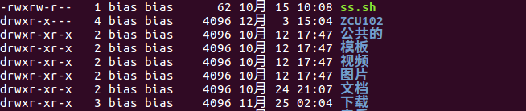
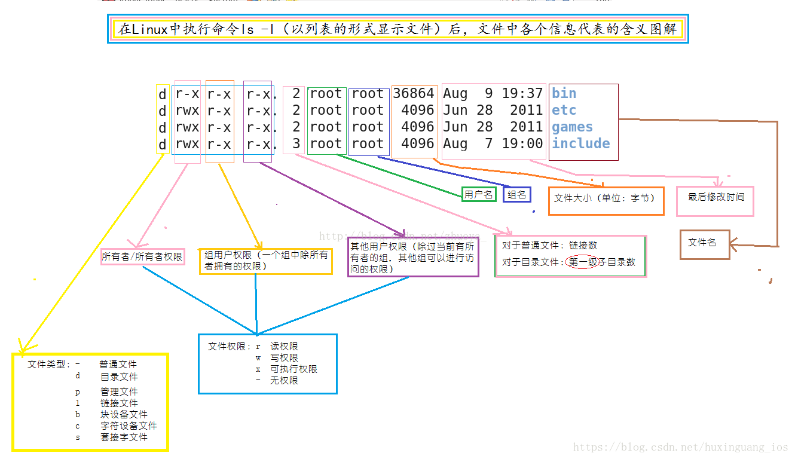

### 第一章 Ubuntu的进化

- **linux的全称是GNU/Linux**，严格来说，linux只是一个内核kernel，我们使用的linux发行版本其实是linux内核再加上GNU丰富的自由软件组成。

- ubuntu版本号的命名规则是“年份的后两位.发布的月份”。eg16.04即2016年04月发布。

  同时每个ubuntu版本在开发之初都有一个开发代号，命名格式为“形容词+动物”，而且两个单词的首字母要一样，eg16.04的代号为Xenial Xerus，译为“好客的非洲地松鼠”。

### 第五章 文件系统和文件管理

- /bin：普通用户和系统管理员可以共享的各种通用二进制（binary）程序
- /boot：**引导文件**
- /dev：系统支持的所有**设备文件**
- /etc：系统管理和维护的所有**配置文件**
- ～表示家目录，即/home/bias目录;一个点.表示当前目录;两个点..表示上一级目录，可以用cd .. 去到当前目录的上一级目录。
- sudo可以在5分钟内将普通用户临u时变为超级用户;而su命令是直接变成超级用户。

**5.1 常用的文件管理命令**

- **复制文件和目录**

  复制文件就cp+文件名+目标路径（可以绝对也可以相对）

  `cp ss.sh ./ZCU102/`

  复制目录就是多了一个-r的参数，cp+-r+目录名+目标路径

  `cp -r DNNDK ./ZCU102/`

- **删除文件和目录**

  rm+文件名

  rm+-r+目录名

- **创建文件和目录**

  **vim a**创建文件a

  touch+a可以创建一个名为a的空文件

  mkdir+目录名创建空目录

- **移动文件和目录**

  mv+文件名+目标路径

  mv+目录名+目标路径

- **浏览文本文件**

  cat +文件名，会直接显示文本文件的内容

- tar -zxvf

**5.2 文件和目录权限**

使用ls -l可以看到当前路径下所有文件和目录的权限（使用ll命令可以看到当前目录下所有文件和目录包括隐藏的和上级目录的权限），也可以使用ls -l filename和ls -ld foldername来单独查看单个文件或者目录的权限

出去开头表示文件类型的字母以外，剩下的9个字母表示权限，如果把r，w，x置为1,没有置为0,那么就可以用一个二进制数来表示权限，一般我们用8进制数来表示。eg上图第一个为111110100,8进制的权限代码即为764,即文件的权限代码764.

当我们创建一个新的文件或目录时，会有默认的权限代码，使用umask可以看到它的值，默认是0002（只看后三个），而文件的默认权限就是666-002=664,目录的默认权限就是777-002=775.当然我们也可以自己修改umask的值，修改之后权限的默认值就不能用666和777减去它的值算了，就得查看**标准权限计算表**

| umask | file | directory |
| ----- | ---- | --------- |
| 0     | 6    | 7         |
| 1     | 6    | 6         |
| 2     | 4    | 5         |
| 3     | 4    | 4         |
| 4     | 2    | 3         |
| 5     | 2    | 2         |
| 6     | 0    | 1         |
| 7     | 0    | 0         |

> 这个表涵盖了所有的情况，对于umask=002同样适用，只是当umask=002时使用666和777减002算起来比查表简单。

**5.3 通过权限符号修改访问权限**

chmod+指定权限+文件或目录，指定权限可以使用权限符号也可以使用表示权限的三位8进制数。

- chmod 777 a  使用符号直接修改即可

- 使用权限符号时

  - u：文件属主
  - g：同组的
  - o：其他用户，即不是同组的
  - a：所有用户

  后面跟上加号减号或等于号表示增加、撤销和赋予相应的权限。

  eg：要修改src目录的权限，默认给的权限太大，rwxrwxr-x,现在要把除了属主之外用户的权限都去掉“

  chmod g-rwx,o-rx src      处理完之后权限变为rwx------

  要把权限加回来：

  chmod g=rwx，o+r src 

**5.4 修改文件的属主信息**

chown bias.bias src或chown bias:bias src

把src的用户名和组名设置为bias.bias，冒号和点效果完全等效，当然如果只改用户名可以用chown bias src，同样只改用户组名可以用chown.bias src(或chown :bias src)

#### 

 