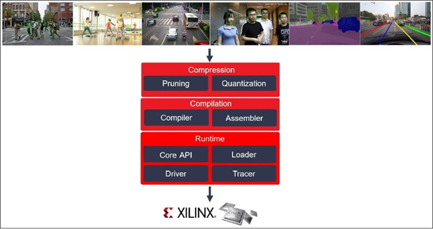
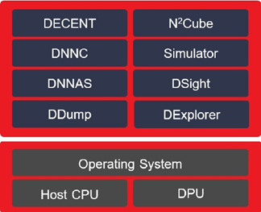
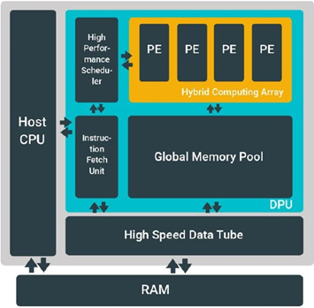

#### DNNDK框架

#### DNNDK工具链

#### host_x86

DECENT(Deep Compression Tools)

> 推理过程是计算密集的，因此需要较高的内存带宽满足边缘应用程序的低延迟和高吞吐。
>
> decent采用粗粒度修建，训练量化和权值共享解决这些问题

DNNC(Deep Neural Network Compiler)

> 专为DPU设计的专用编译器，将神经网路算法映射为DPU指令，过平衡计算负载和内存访问来最大限度地利用DPU资源

上述二者允许神经网络在DPU推理引擎上进行优化和加速

DDump

DLet

#### target-board

Dexplorer

DSight

DDump

DPU driver

runtime N^2Cube（Neural Network Runtime）

#### DPU

集成在PL中，直接连接到PS。DPU是可配置的，公开了几个参数，可以指定这些参数来优化PL资源或自定义可用的特征。在PG338中可以得到更多信息

